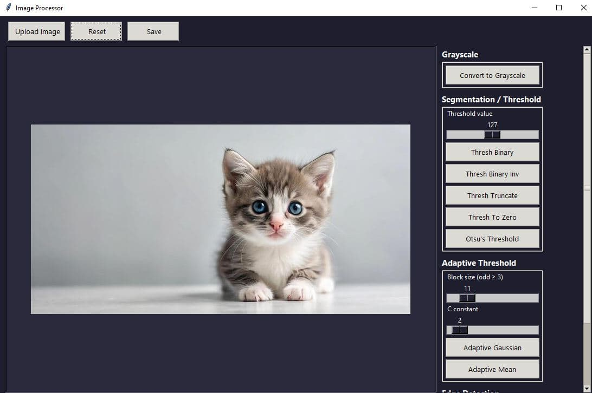
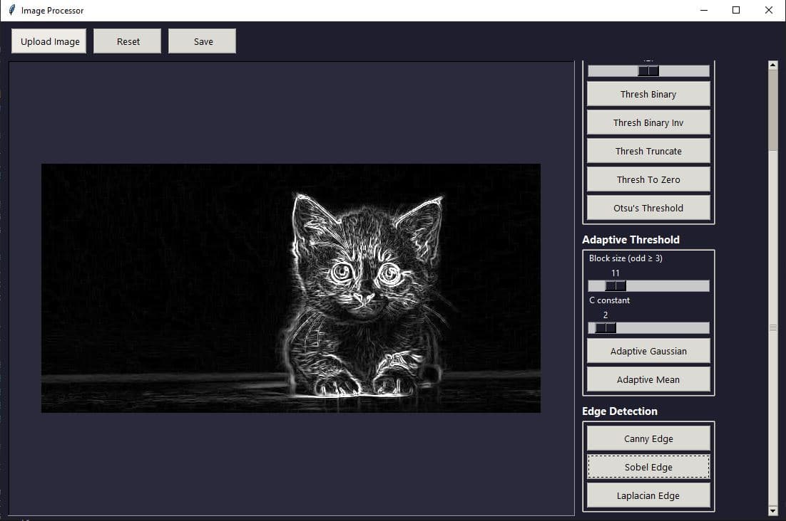

# Image Processor
  
<table>
  <tr>
    <td></td>
    <td></td>
  </tr>
</table>
A desktop image preprocessing tool built with Python, Tkinter, and OpenCV. Load an image, apply various filters and transformations, and save the result.


---


## Features

- **Grayscale conversion**
- **Segmentation / Thresholding** — Binary, Binary Inverse, Truncate, To Zero, and Otsu's method
- **Adaptive Thresholding** — Gaussian and Mean, with adjustable block size and C constant
- **Edge Detection** — Canny, Sobel, and Laplacian
- Live image preview that scales to your window size
- Upload, reset, and save your work at any point

---

## Getting Started

### Prerequisites

You'll need [uv](https://github.com/astral-sh/uv) to manage the environment. If you don't have it yet:

```bash
pip install uv
```

### Installation

Clone the repo and install dependencies:

```bash
git clone https://github.com/Sxres/ComputerVision.git
cd ComputerVision
uv sync
```

That's it. `uv sync` will create a virtual environment and install everything from the lockfile automatically.

### Running the App

```bash
uv run python image_processor.py
```

---

## Usage

1. Click **Upload Image** to load any PNG, JPG, JPEG, BMP, TIFF, or WebP file
2. Use the controls on the right panel to apply filters — sliders let you tune parameters before applying
3. Hit **Reset** at any time to go back to the original image
4. Click **Save** to export the processed image

---

## Project Structure

```
ComputerVision/
├── image_processor.py          # Entry point and full application
├── pyproject.toml              # Project metadata and dependencies
├── uv.lock                     # Lockfile (committed for reproducibility)
└── README.md                   # Readme
```

---

## Dependencies

- [OpenCV](https://opencv.org/) — image processing
- [Pillow](https://python-pillow.org/) — image display via Tkinter
- [NumPy](https://numpy.org/) — array math for edge detection
- Tkinter — comes bundled with Python

---

## Notes

- The app processes images in-memory, so your original file is never modified unless you explicitly save
- Adaptive threshold block size is always kept odd (the slider enforces this automatically)
- Edge detection outputs are grayscale — applying color operations afterward will work fine since the app handles the conversion internally

